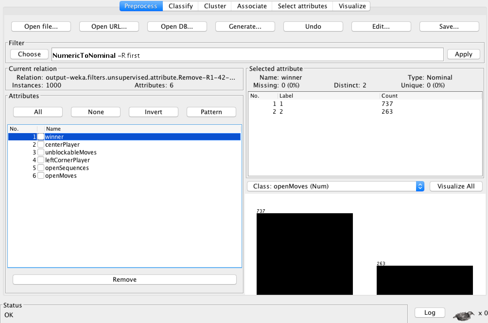
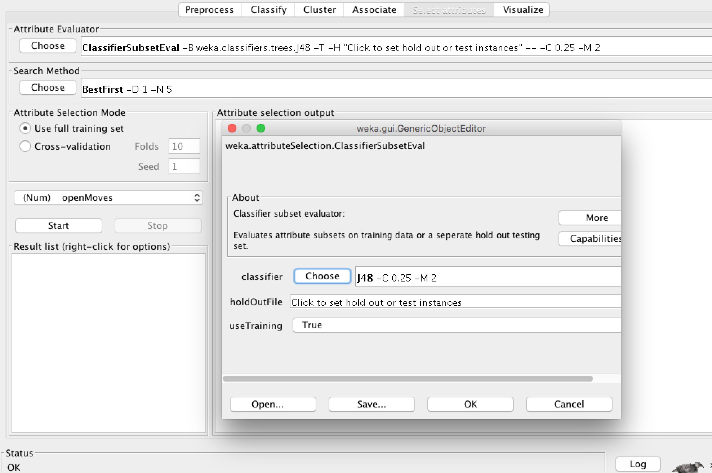
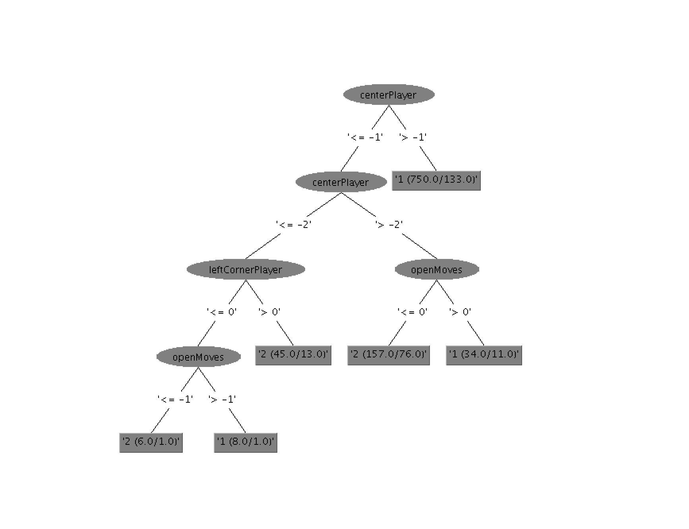
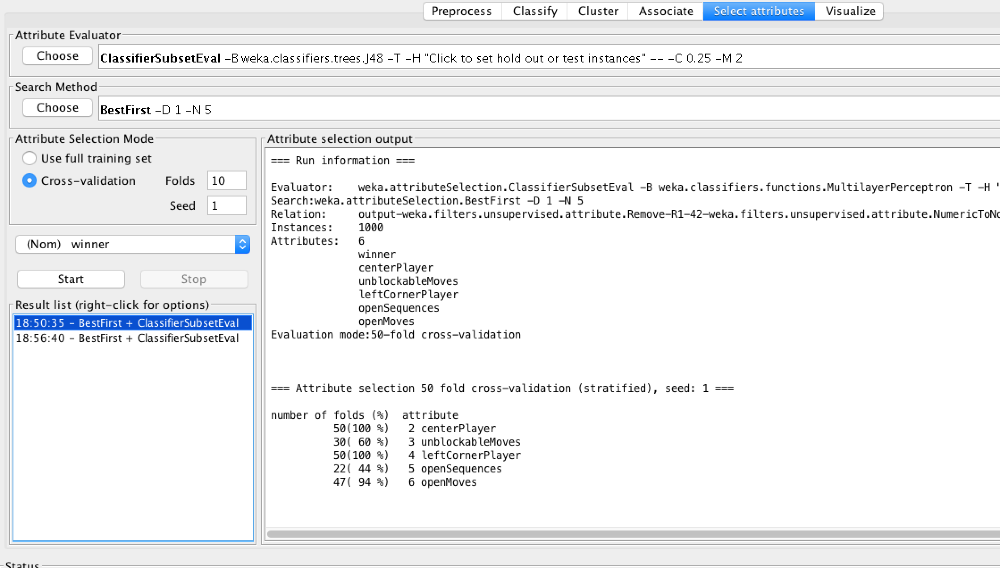
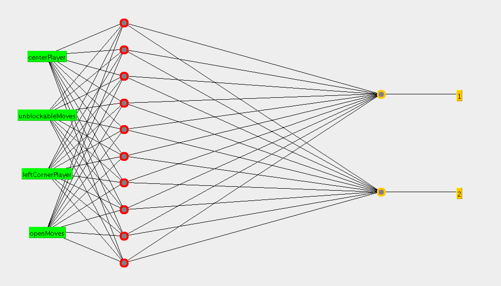

# Data Mining With Python and Weka
  _By Yang Liu (yliu17) & Tyler Nickerson (tjnickerson)_

  For this project, a small program was written in Python 2.7 to extract feature data from sets of integers representing Connect-4 game board states (for more info on these strings, [click here](dataDescription.md)). These features were then plugged into [Weka 3](http://www.cs.waikato.ac.nz/ml/weka/), a Java program by New Zealand's [University of Waikato](http://www.waikato.ac.nz) that runs machine learning algorithms on sets of data. In this particular experiment, the feature was data was used to train/build both a neural network and a decision tree.

## The Features
  As previously stated, each string (line) of input data is interpreted as a Connect-4 board state and loaded into a NumPy matrix. Using NumPy matrix operations, each board state is analyzed and five state features are produced for use in Weka. Those features as follows:

### leftCornerPlayer
#### Description
  Returns the number of whichever player is in the left-hand corner of the board. While not entirely useful, this feature acts primarily as a benchmark and does not have a significant impact on the rest of the features.

#### Strategy
  This feature was chosen as a benchmark to measure how a poor feature would perform during Weka testing.

### centerPlayer
#### Description
  Returns the difference in the number of checkers by each player in the center of the board (no checkers along the left or right edges). If the value is positive, player1 has more tiles in the center. If the value is negative, player2 has more tiles.

#### Strategy
  This feature was to chosen in order to provide insight as to which player currently has control of the board.

### openMoves <a id="openm"></a>
#### Description
  Returns the difference in "open" moves between players (i.e moves in which another checker may be added to left or right side of the sequence). If the value returned is _positive_, then player one has made more "open" moves than player two. If the value is _negative_, then the opposite is true. The larger the absolute value of the returned integer, the greater the difference in moves. openMoves is computed by checking all horizontal and vertical moves and counting the strings of same-player checkers that have open spaces on either end. The returned value is the player two count subtracted from the player one count.

#### Strategy
  This feature was chosen in order to measure player strategy. A higher absolute value for openMoves suggests that the player is able to freely make open moves without their opponent blocking them. As a result, this feature comments more on the opponent's strategy than the strategy of the player at hand.

### openSequences <a id="opens"></a>
#### Description
  Returns the difference in "open" checker sequences between players (i.e. sequences of checkers with gaps in the middle, allowing moves to be blocked). Similar to openMoves, player 1 has more "open" sequences on the board than player 2 if the difference is positive. The opposite holds true if the returned difference is negative. openSequences is calculated by checking all horizontal and vertical moves and seeing if there are gaps in any of the move sequences. In other words, every open space is analyzed using the following criteria:
- Is there "ground" below the space for a player to make a move (i.e. another checker or the bottom of the board)?
- Are the checkers to the left and right of the space are both of the same player?

  If both of the above questions answer yes, then the sequence is "open". The count for player two is then subtracted from the count for player one and the difference is returned.

#### Strategy
  This feature was chosen in order to again measure the strategy of the players. However, unlike [openMoves](#openm), which measures the opponent's basic ability to block moves, openSequences measures the opponent's ability in blocking moves which consist of two parts (a "front" and a "back"). This is representative of their ability to see the "big picture", so-to-speak, instead of blocking moves in a very quick, almost reflex-based fashion. If the difference is lower, than the opponent has a fairly good blocking strategy. If it is lower, it does not.

### unblockableMoves <a id="unblockable"></a>
#### Description
  Returns an integer denoting which player has more valid moves that cannot be easily blocked due to an "open" sequence. This is achieved by simply subtracting openSequences from openMoves. If the integer is positive, then player one has more "un-blockable" moves. If the integer is negative, then player two has more. The term "blockable" here is very specific, referring only to sequences which can be blocked by inserting a tile somewhere in the middle of it.

#### Strategy
  This feature was chosen to determine whether moves that could be easily completed/blocked by placing checkers in the center of them perform better or worse than moves which can only be completed/blocked by placing checkers on either end.

## Training
### Cross Validation
  Cross validation is way to estimate the sample error rate of data models. This is done by breaking example data into both training sets and testing sets (also known as _validation sets_).

  Cross-validation helps prevent **overfitting**, a phenomenon in which too much random noise finds its way into the model, skewing the results and leading to poor predictive performance. Cross-validation also ensures our model will more accurately generalize when making future predictions. Cross validation helps us to select the best model among our hypothesis space by calculating average validation error rate and only select the  hypotheses that help minimizing this error.

### k-Fold Cross-Validation
  For this experiment, we used the k-fold cross-validation algorithm in Weka to validate our training. We chose k-fold over holdout cross-validation due to its ability to maximize data utilization. In other words, k-fold makes use of all of the data it is given. It achieves this by splitting the input data into _k_ equal subsets, using 1 / _k_ for testing only and using the remaining subsets for training the neural network. Holdout cross-validation uses one half of the data for training and the other half for testing, is not nearly as effective as using multiple subsets. As seen with the [neural networks project](https://github.com/WPI-CS4341/Artificial-Neural-Networks), the network performs best when roughly 2/5 of the data is used for validation purposes, something that is not achievable with a simple 50/50 divide.

# Results


## Features as a Decision Tree
### Feature Selection


Prior to building a decision tree from our features, feature selection was run in Weka in order to filter out irrelevant features that would not hold a large influence over the outcome of the tree. We used the J48 (decision tree) classifier to achieve this, obtaining the following results:

attribute            | number of folds (%)
-------------------: | ------------------:
    **centerPlayer** |       **10(100 %)**
~~unblockableMoves~~ |        ~~2( 20 %)~~
**leftCornerPlayer** |       **10(100 %)**
   ~~openSequences~~ |        ~~3( 30 %)~~
       **openMoves** |        **7( 70 %)**

By constructing a decision tree in Weka using the Connect-4 features, we were able to draw conclusions regarding the effectiveness of these features in such a tree. Our best case tree resulted in the following, consisting of a tree size (node count) of eleven with a total of six leaves:

  

With the corresponding Weka output:

```
  centerPlayer <= -1
  |   centerPlayer <= -2
  |   |   leftCornerPlayer <= 0
  |   |   |   openMoves <= -1: 2 (6.0/1.0)
  |   |   |   openMoves > -1: 1 (8.0/1.0)
  |   |   leftCornerPlayer > 0: 2 (45.0/13.0)
  |   centerPlayer > -2
  |   |   openMoves <= 0: 2 (157.0/76.0)
  |   |   openMoves > 0: 1 (34.0/11.0)
  centerPlayer > -1: 1 (750.0/133.0)
```

Given these results, we were able to conclude that the centerPlayer, leftCornerPlayer, and openMoves features had the greatest influence on the winner of the game. Although centerPlayer and openMoves seemed like fair estimates as to how the game might be going, it was very surprising to find that leftCornerPlayer, although deemed significant during feature selection, held very little influence over the tree produced. leftCornerPlayer, in reality,

### WEKA procedures
### Cross validation performance

                                 | Number Of Instances | Rate
-------------------------------: | ------------------: | ----
Correctly Classified Instances   |                 720 | 72%
Incorrectly Classified Instances |                 280 | 28%

```
Twenty eight percent of error rate seems tolerable to our decision tree model.
```

## Neural Network

### Feature Selection



Similar to the decision tree model, feature selection was once again run in preparation for running the features through the neural network.

attribute            | number of folds (%)
-------------------: | ------------------:
    **centerPlayer** |       **50(100 %)**
**unblockableMoves** |       **30( 60 %)**
**leftCornerPlayer** |       **50(100 %)**
   ~~openSequences~~ |       ~~22( 44 %)~~
       **openMoves** |       **47( 94 %)**

  For neural network, all attributes seems have great impact on the game result except "openSequences".

### WEKA procedures
### Cross validation performance

```
                             | Number instances | Rate
```

-------------------------------: | ---------------: | ----:   Correctly Classified Instances |              758 | 75.8% Incorrectly Classified Instances |              242 | 24.2%

  Twenty four percent of error rate seems tolerable to our neural network model.

### The network
  

```
  Sigmoid Node 0
      Inputs    Weights
      Threshold    -0.28621153737967514
      Node 2    0.05923524956772622
      Node 3    1.1515354178548236
      Node 4    0.8103312237913829
      Node 5    0.7377636915389297
      Node 6    0.9529730773243038
      Node 7    2.69516054285918
      Node 8    0.8169114430570755
      Node 9    1.1170517562985691
      Node 10    1.093483265705679
      Node 11    1.8690038088520764
  Sigmoid Node 1
      Inputs    Weights
      Threshold    0.2859213531505996
      Node 2    -0.0607989008512651
      Node 3    -1.1528831289819796
      Node 4    -0.795013426217962
      Node 5    -0.7703251441456931
      Node 6    -0.9574643554892507
      Node 7    -2.695830231045731
      Node 8    -0.7957298380994041
      Node 9    -1.056890675529909
      Node 10    -1.1543047426259694
      Node 11    -1.8689713029377724
  Sigmoid Node 2
      Inputs    Weights
      Threshold    -3.239000568935438
      Attrib centerPlayer    0.5869395377671233
      Attrib unblockableMoves    1.1507246836341918
      Attrib leftCornerPlayer    -0.2590241558683983
      Attrib openMoves    -0.2978709707146848
  Sigmoid Node 3
      Inputs    Weights
      Threshold    -3.8679905008802287
      Attrib centerPlayer    3.0122096599058112
      Attrib unblockableMoves    -2.1025690321848636
      Attrib leftCornerPlayer    -0.5943666858371563
      Attrib openMoves    -0.29784038651620903
  Sigmoid Node 4
      Inputs    Weights
      Threshold    -3.2766582415698675
      Attrib centerPlayer    2.0354331767260305
      Attrib unblockableMoves    -1.8315692191141846
      Attrib leftCornerPlayer    -0.5156113861535958
      Attrib openMoves    1.111401588572593
  Sigmoid Node 5
      Inputs    Weights
      Threshold    -3.4533480448725595
      Attrib centerPlayer    1.6466999344183297
      Attrib unblockableMoves    -1.692302705966911
      Attrib leftCornerPlayer    -0.7106753913782027
      Attrib openMoves    0.8907941137171633
  Sigmoid Node 6
      Inputs    Weights
      Threshold    -3.1418359052429374
      Attrib centerPlayer    3.426043005922332
      Attrib unblockableMoves    -1.8577064815708773
      Attrib leftCornerPlayer    -0.2792769885531882
      Attrib openMoves    0.591610555800771
  Sigmoid Node 7
      Inputs    Weights
      Threshold    -0.7322181696150007
      Attrib centerPlayer    13.198092180925178
      Attrib unblockableMoves    -3.951788572544002
      Attrib leftCornerPlayer    4.369315618169003
      Attrib openMoves    10.652129896768445
  Sigmoid Node 8
      Inputs    Weights
      Threshold    -2.884756691361181
      Attrib centerPlayer    1.7024269111815107
      Attrib unblockableMoves    -0.5997936331706902
      Attrib leftCornerPlayer    -0.3920971226853196
      Attrib openMoves    -0.2312365799448576
  Sigmoid Node 9
      Inputs    Weights
      Threshold    -3.599053198731778
      Attrib centerPlayer    2.976537914097033
      Attrib unblockableMoves    -1.9605150932284536
      Attrib leftCornerPlayer    -0.5166991526017269
      Attrib openMoves    -0.07745062362020148
  Sigmoid Node 10
      Inputs    Weights
      Threshold    -3.762172006929382
      Attrib centerPlayer    2.9155071872336213
      Attrib unblockableMoves    -1.9369936964350651
      Attrib leftCornerPlayer    -0.5796408643781243
      Attrib openMoves    -0.3566367251646009
  Sigmoid Node 11
      Inputs    Weights
      Threshold    -5.843603142764188
      Attrib centerPlayer    2.485687525965516
      Attrib unblockableMoves    -3.640710955866215
      Attrib leftCornerPlayer    -7.388066813067393
      Attrib openMoves    9.41344858194025
  Class 1
      Input
      Node 0
  Class 2
      Input
      Node 1
```

# Analysis
## Decision Tree
  The most important feature have to be the root to construct the shortest decision tree. The root split most of the data accurately and leaving rest of them to be categories with enforcement of other features on its child nodes. After each iteration to the next tree level, more features will be categorized correctly until no remaining features show strong relationship to the result at all.

## Neural network
  More important feature in the neural network have more weights in the network. The weights of features indicate how much it contributes to the result of next layer, eventually reaching the output layer.

## Findings
### Decision tree
  The data shows that "centerPlayer" contributes the most to game winning since it splits out the most amount data records decisively (around 750 records). It is reasonable to think that checkers located near the center of the board have more opportunities to from sequences in row and in diagonal than near the edge or the corners. Also "openMoves", (successfully classified around 150 records), leads to part of the game result due to the player who have more open move, also have more opportunities left to connect his checkers together. Feature "leftCornerPlayer" seems have "no much effect" on the game results since it categorized only few results in the tree and actually have no reason to much influence.

### Neural Network
  The network results showed also confirm our findings by showing that "centerPlayer" (range form -0 to 13) features the most considerable average weights. And the "openMoves" (range from 0 to 10), also contributes some exceptionally high weight to the game results.
